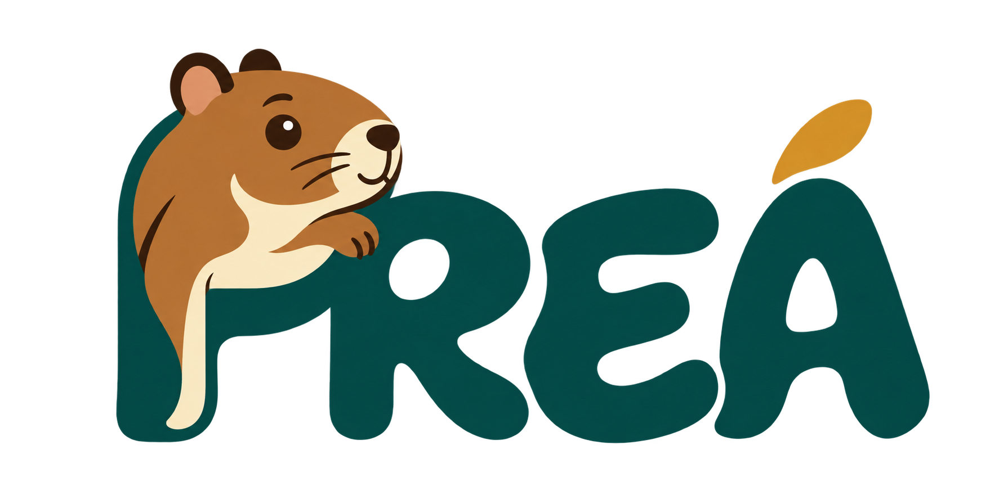

# PREÁ — Plataforma de Recursos Educacionais Abertos

**Conhecimento para compartilhar, adaptar e aprender em comunidade.**

## 1. Apresentação

O PREÁ é um projeto de pesquisa e desenvolvimento de uma plataforma aberta para **organizar, documentar, encontrar e reutilizar Recursos Educacionais Abertos (REA)**, relacionando esses materiais às competências educacionais que podem apoiar.

A proposta reúne Educação Aberta, desenvolvimento de software e formação científica e tecnológica. Seu desenvolvimento é incremental e colaborativo, com participação de estudantes do Ensino Médio Integrado em Informática, de Análise e Desenvolvimento de Sistemas (ADS) e, conforme a composição da equipe, da Licenciatura em Computação.

## Por que PREÁ?

O nome combina a sigla de **Plataforma de Recursos Educacionais Abertos** com uma referência ao **preá**, animal presente no Brasil. Essa escolha aproxima a identidade do projeto de uma linguagem familiar e expressa três valores que orientam a proposta:

- **Agilidade e adaptação:** a imagem do preá inspira uma plataforma que busca ser rápida, flexível e adaptável às necessidades de professores e estudantes. Esses valores orientam o projeto e deverão ser avaliados durante o desenvolvimento.

- **Espírito comunitário:** o nome representa a intenção de construir uma comunidade de colaboração, compartilhamento de conhecimento e valorização das contribuições de cada participante.

- **Identidade brasileira e proximidade:** um nome curto, popular e ligado ao contexto brasileiro torna a proposta mais próxima das pessoas. A acessibilidade das interfaces e dos materiais também deverá ser tratada como uma preocupação do desenvolvimento.

Como o desenvolvimento ocorrerá ao longo de diferentes etapas e contará com contribuições de diferentes participantes, é fundamental que as informações do projeto sejam registradas de forma organizada e possam ser recuperadas posteriormente.

Para isso, o PREA utilizará três ambientes principais:

* **GitHub:** desenvolvimento, tarefas, decisões técnicas e discussões do projeto;
* **Google Drive/Docs:** produção e edição colaborativa de documentos acadêmicos;
* **Google Meet:** reuniões síncronas.

O WhatsApp poderá ser utilizado para comunicação rápida, mas **não será considerado repositório oficial das informações e decisões do projeto**.

# 2. Onde cada informação deve ficar?

| Informação                             | Ferramenta                 |
| -------------------------------------- | -------------------------- |
| Código-fonte                           | GitHub                     |
| Issues e tarefas                       | GitHub                     |
| Planejamento do desenvolvimento        | GitHub Projects            |
| Discussões técnicas                    | GitHub Discussions         |
| Dúvidas que possam interessar ao grupo | GitHub Discussions         |
| Resultados das pesquisas dos alunos    | GitHub + Google Docs       |
| Decisões importantes do projeto        | GitHub Discussions         |
| Requisitos do sistema                  | GitHub Issues/Documentação |
| Modelos e especificações técnicas      | GitHub                     |
| TCC                                    | Google Docs                |
| Relatórios dos subprojetos             | Google Docs                |
| Revisão bibliográfica                  | Google Docs/Drive          |
| Reuniões                               | Google Meet                |
| Avisos rápidos                         | WhatsApp                   |

**Regra geral:** se uma informação for importante para compreender, desenvolver, justificar ou manter o PREA, ela deve ser registrada em um ambiente institucional do projeto e não permanecer exclusivamente em uma conversa privada.

# 3. GitHub: desenvolvimento e memória técnica

O GitHub será o principal ambiente de desenvolvimento e registro técnico do PREA.

## 3.1. GitHub Projects — "O que precisa ser feito?"

As tarefas do projeto serão organizadas no **GitHub Projects**.

Cada tarefa deverá indicar, sempre que possível:

* o que precisa ser realizado;
* responsável;
* prazo;
* fase do projeto;
* tipo de atividade;
* relação com o TCC ou com algum subprojeto de pesquisa.

O fluxo básico será:

**Backlog → A Fazer → Em Andamento → Em Revisão → Concluído**

Uma tarefa não deve ser considerada concluída apenas porque foi realizada. Quando necessário, deverá existir evidência correspondente, como código, documento, resultado de pesquisa, teste ou outro artefato.

# 4. GitHub Discussions: fórum assíncrono

O **GitHub Discussions** será o fórum oficial do PREA.

Deverá ser utilizado para discussões que possam gerar conhecimento útil para o projeto ou que precisem ser recuperadas posteriormente.

Entre os possíveis temas estão:

* dúvidas;
* resultados preliminares de pesquisas;
* propostas de funcionalidades;
* requisitos;
* decisões de arquitetura;
* metadados;
* interoperabilidade;
* usabilidade e acessibilidade;
* resultados de testes;
* decisões relacionadas ao TCC.

### Exemplo

Um estudante pode publicar:

> **ADS2 — Proposta de metadados para recursos educacionais**

Apresenta os resultados encontrados na pesquisa e propõe determinados campos para o PREA.

Após a discussão, a decisão poderá gerar uma Issue:

> **[REQ] Definir metadados mínimos de um recurso educacional**

Dessa forma, a discussão não fica isolada: ela pode resultar em uma atividade concreta de desenvolvimento.

# 5. Google Docs: produção acadêmica

O Google Docs será utilizado para documentos que exigem escrita colaborativa e revisão textual.

Entre eles:

* TCC;
* relatórios de pesquisa;
* relatórios de ACC;
* revisão bibliográfica;
* instrumentos de pesquisa;
* documentos acadêmicos;
* textos para artigos ou apresentações.

Os documentos devem possuir nomes padronizados e permanecer organizados nas pastas correspondentes do Google Drive.

O Google Docs **não substitui o GitHub** para o controle de tarefas e decisões técnicas.

# 6. WhatsApp: comunicação rápida

O WhatsApp poderá ser utilizado para:

* avisos rápidos;
* lembretes;
* comunicação urgente;
* confirmação de reuniões;
* combinação de horários.

Entretanto, informações importantes não devem permanecer exclusivamente no WhatsApp.

Por exemplo, a seguinte informação:

> "Decidimos utilizar determinado modelo de metadados."

deverá ser registrada posteriormente no GitHub, caso represente uma decisão relevante para o projeto.

**WhatsApp é canal de comunicação; GitHub é parte da memória oficial do projeto.**

# 7. Como registrar uma decisão?

Sempre que uma discussão resultar em uma decisão relevante, deve-se procurar registrar:

**Problema → Evidências → Alternativas → Decisão → Justificativa**

Exemplo:

**Problema:** como representar a licença de um recurso?

**Evidências:** modelos encontrados nos repositórios analisados.

**Alternativas:** campo textual, vocabulário controlado ou identificador de licença.

**Decisão:** utilizar uma representação estruturada.

**Justificativa:** facilitar busca, interoperabilidade e processamento automático.

Esse registro será especialmente importante para o TCC.

# 8. Relação entre pesquisa e desenvolvimento

Os subprojetos de pesquisa dos estudantes de ADS não devem ser tratados apenas como tarefas auxiliares.

Cada pesquisa deverá produzir resultados que possam alimentar diferentes etapas do PREA.

A relação esperada é:

**Pesquisa → Evidência → Discussão → Decisão → Requisito → Desenvolvimento → Teste → Avaliação**

Exemplos:

* pesquisa sobre **repositórios** → funcionalidades e requisitos;
* pesquisa sobre **metadados** → modelo de dados e mecanismos de busca;
* pesquisa sobre **interoperabilidade** → arquitetura, formatos e APIs;
* pesquisa sobre **arquitetura e requisitos** → decisões técnicas e requisitos não funcionais.

Assim, os resultados produzidos nos primeiros meses poderão continuar sendo utilizados durante as etapas posteriores do TCC.

# 9. Princípios de colaboração

Todos os participantes devem observar cinco princípios:

### 1. Registrar

Informações importantes devem ser registradas no ambiente adequado.

### 2. Compartilhar

Resultados de pesquisa devem ser disponibilizados à equipe.

### 3. Justificar

Decisões relevantes devem possuir justificativa e, quando possível, evidências.

### 4. Rastrear

Sempre que possível, deve ser possível identificar a relação entre pesquisa, requisito, implementação e teste.

### 5. Respeitar o trabalho coletivo

Alterações em código, documentos e decisões devem considerar o trabalho já realizado pelos demais integrantes.

# 10. Regra de ouro

> **Se outra pessoa precisar compreender amanhã por que determinada decisão foi tomada hoje, essa informação deve estar registrada no PREA.**

O objetivo deste manual não é criar burocracia, mas garantir que o conhecimento produzido durante o projeto não se perca e possa ser reutilizado pela equipe, pelo TCC e pelas futuras versões do PREA.
